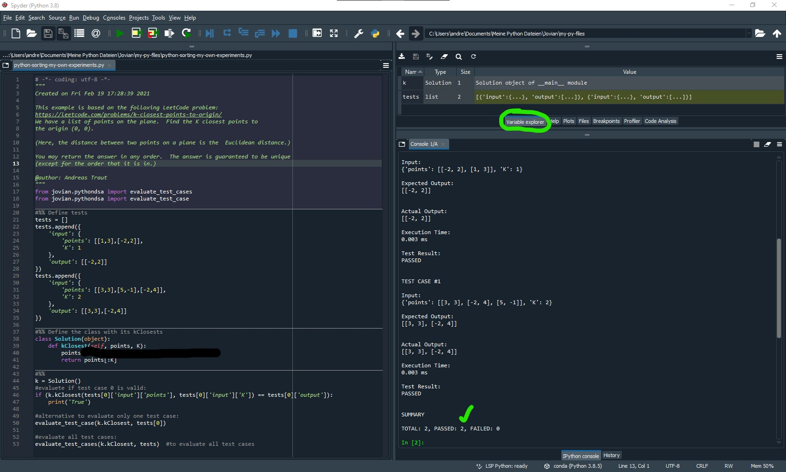
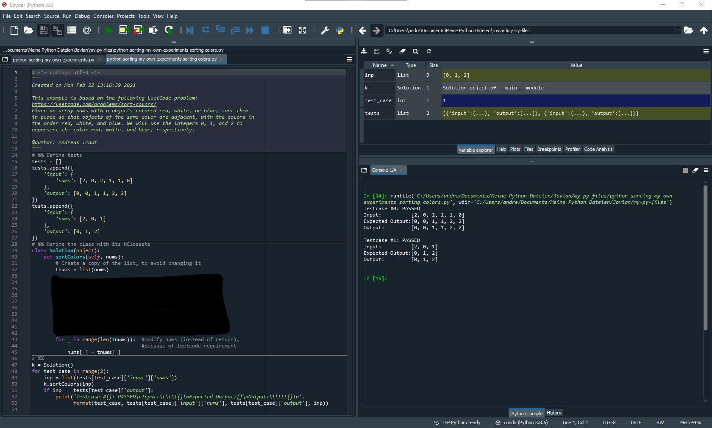

# Algorithms, Data Structures and Coding

Author: Andreas Traut  
 Date: 22.02.2021  
 [Download as PDF](https://raw.githubusercontent.com/AndreasTraut/Algorithms-Data-Structures-and-Coding/main/README.pdf)

\[TOC\]

## Algorithms, Data Structures and Coding

### 0. Introduction

#### a\) Aim of this repository

The aim of this repository is to improve coding skills and enhance skills in algorithmic thinking and data structures.

#### b\) Motivation for this repository

I am programming in different languages and environments for nearly my whole life:

* Starting in the 1980s / 1990s with [GW-Basic](https://de.wikipedia.org/wiki/GW-BASIC) and the integrated development environment \(IDE\) [Turbo Pascal](https://de.wikipedia.org/wiki/Turbo_Pascal).
* Then in the 2000s / 2010s I started with [C++](https://de.wikipedia.org/wiki/C%2B%2B), where I understood the **object oriented way of thinking**. I learnt a lot in C++ at my final years at university as well as during the first years at my first employer. Today my 8 cm thick _"C++ programming bible"_ serves as an elevation for my second monitor, which I had to set up due to the Corona-related home office.
* I used [SQL](https://de.wikipedia.org/wiki/SQL) a lot and also got quiet skilled in finding solutions with [Visual Basic \(VBA\)](https://de.wikipedia.org/wiki/Visual_Basic_for_Applications). VBA \(applied in Excel or [Access](https://de.wikipedia.org/wiki/Microsoft_Access)\) is fun for me and served me a lot during my whole professional and private.
* In 2019 I learnt the advantages of the [Jupyter-Notebooks](https://jupyter.org/): beautiful, intuitive, easy to use and build. But there is something, I don't like in Jupyter-Notebooks, which I will exlain below.
* And today I am a big fan of [Python](https://de.wikipedia.org/wiki/Python_%28Programmiersprache%29): it's so much more fun to use Python instead of C++: I enjoyed not having these opening brackets `{` and closing brackets `}` and `;` a the end of a line! Such a relieve for my eyes.

I am glad, that lots is similar in all these decades: **the way of thinking as a programmer**. My motivation is to give you some basic hints, advises and guidance to improve your coding skills.

#### c\) Structure of this repository

**\(i\) First part: How to improve your coding skills: Certificates and Challenges**

In the _first part_ I will explain, how certificates and coding challenges can be useful for you to improve your coding skills.

**\(ii\) Second part: Examples**

In the _second part_ I will work on some interesting examples.

### I. How to improve your coding skills: Certificates and Challenges

#### 1. Earn a certificate

A good way for improving your coding skills are by going through some online courses and trying to earn a certificate. There are a lot of other ressources: maybe start getting an overview on [Coursera](https://www.coursera.org/). These courses are nice because the teachers are usually highly skilled \(from universities\) and the technical infrastructure for the courses is rather advanced: there are videos with subtitles and transcript and you can easily navigate through these videos by reading across these transcipts and jumping to the positions in the video, which you want to listen to. You can monitor your learning curve and weekly progress. But the Coursera certificates usually cost some money.

If you want to find something cheaper, then I can recommend the ["Data Structures and Algorithms in Python"](https://jovian.ai/learn/data-structures-and-algorithms-in-python) from Jovian. When I worked for it in 02/2021 is was for free. It uses Jupyter-Notebooks and is definitively a lot of fun! You will learn in video tutorials and practise with well documented Jupyter-Notebooks how to work with python classes, binary trees, sorting algorithms and undertand how to solve coding problems systematecally.

There are various other ressources for earning a certificate and listing up, what I found is not very helpful at the end for you: try to find **the certificate which YOU want to earn!** I promise: working for it is a lot of fun.

#### 2. Get into coding challenges

Another advice I can give you is to get into coding challenges. When you accept a coding challenge, then a problem will be shown and would have to solve it in your preferred programming language \(python, java, C++,...\). I tried [LeetCode](https://leetcode.com/) and you will find a lot of other websites, which provide similar concepts. On the left is the problem, on the right some place to programm a solution:


Some of these problems were quiet interesting for me so I wanted to have them in my integrated development environment \(IDE\) [Spyder-IDE](https://www.spyder-ide.org/) in order to debug through the code and extend the examples a bit. I recommend to do use an integrated development environment \(IDE\) as often as you can, instead of always going through Jupyter Notebooks. In my opinion Jupyter Notebooks are **not** always the best environment for learning to code! I agree, that Jupyter Notebooks are nice for doing documentation of python code. It really looks beautiful. But I prefer debugging in an IDE instead of a Jupyter Notebook: having the possibility to set a breakpoint can be a pleasure for my nerves, specially if you have longer programms. Some of my longer Jupyter Notebooks feel from the hundrets line of code onwards more like pain than like anything helpful. And I also prefer having a "help window" or a "variable explorer", which is smoothly integrated into the IDE user interface. And there are a lot more advantages why getting familiar with an IDE is a big advantage compared to the very popular Jupyter Notebooks! I am very surprised, that everyone is talking about Jupyter Notebooks but IDEs are only mentionned very seldomly. But maybe my preferences are also a bit different, because I grew up in a [MS-DOS](https://de.wikipedia.org/wiki/MS-DOS) environment. :-\)

Here is how the problem from above looks like in the Spyder-IDE:



Another example from LeetCode: the [Sort-Colors](https://leetcode.com/problems/sort-colors/) problem:




### II. Examples

In the _second part_ I will work on some interesting examples, which will be available as `.py` Files.

## MIT License

```text
                             MIT License
                    https://opensource.org/licenses/mit-license.php
```

Copyright \(c\) 2021 Andras Traut

Permission is hereby granted, free of charge, to any person obtaining a copy of this software and associated documentation files \(the "Software"\), to deal in the Software without restriction, including without limitation the rights to use, copy, modify, merge, publish, distribute, sublicense, and/or sell copies of the Software, and to permit persons to whom the Software is furnished to do so, subject to the following conditions:

The above copyright notice and this permission notice shall be included in all copies or substantial portions of the Software.

THE SOFTWARE IS PROVIDED "AS IS", WITHOUT WARRANTY OF ANY KIND, EXPRESS OR IMPLIED, INCLUDING BUT NOT LIMITED TO THE WARRANTIES OF MERCHANTABILITY, FITNESS FOR A PARTICULAR PURPOSE AND NONINFRINGEMENT. IN NO EVENT SHALL THE AUTHORS OR COPYRIGHT HOLDERS BE LIABLE FOR ANY CLAIM, DAMAGES OR OTHER LIABILITY, WHETHER IN AN ACTION OF CONTRACT, TORT OR OTHERWISE, ARISING FROM, OUT OF OR IN CONNECTION WITH THE SOFTWARE OR THE USE OR OTHER DEALINGS IN THE SOFTWARE.

