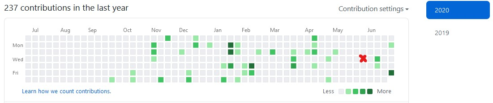
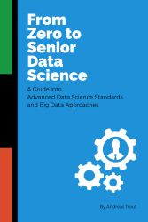
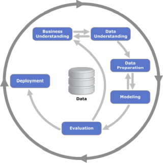
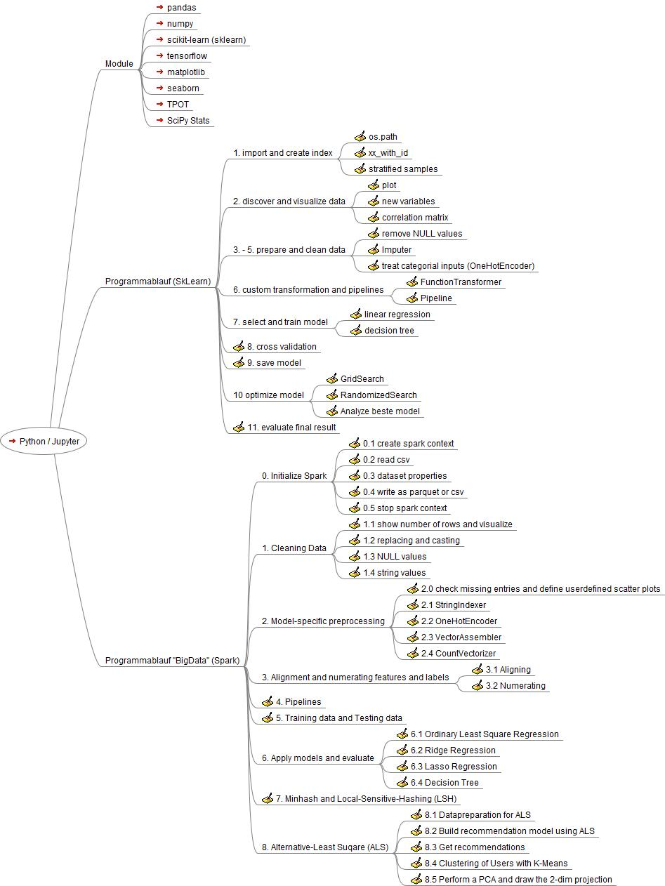
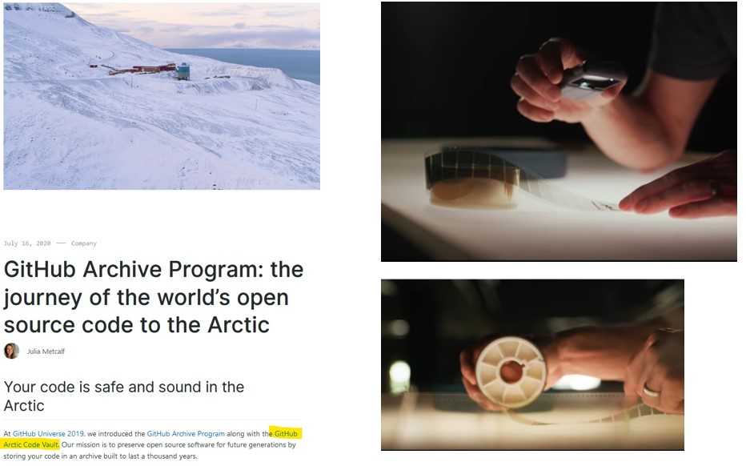

# Arbeitsproben

2019/2020 [Download als PDF](https://raw.githubusercontent.com/AndreasTraut/Arbeitsproben/main/Arbeitsproben%20Andreas%20Traut.pdf)

\[TOC\]

## Arbeitsproben Andreas Traut

### Darf ich mich vorstellen?

Mein Name ist Andreas Traut. Ich habe in Ulm studiert und war als Risikocontroller sowie auch als Auditor in Banken und Versicherungen tätig. Ich habe ein Jahr in Frankreich gelebt und dort meinen Bachelor in Mathematik gemacht. Mein Diplom in Mathematik mit Nebenfach Informatik habe ich in Freiburg absolviert. Anfang 2021 habe ich mich zum zertifizierten "Advanced Data Scientist" qualifiziert. Ich habe 5 Jahre in der Schweiz gelebt und nun bin ich wieder in meiner Heimat Ulm.

Wie man dieser Graphik entnehmen kann, hat mich meine Leidenshaft für GitHub im Oktober 2019 gepackt. Die grünen Quadrate im Bild oben zeigen die Tage, an denen ich neue Inhalte in meine GitHub-Verzeichnisse \("Repositories""\) hochgeladen habe. Am 3. Juni 2020 \(siehe rotes Kreuzchen\) kam mein Sohn auf die Welt, was die kleine Lücke in diesem Zeitraum in der Graphik erklärt. Man sieht: regelmäßig habe ich hier meine Verzeichnisse weiterentwickelt \(siehe auch [hier](https://sourcerer.io/andreastraut)\).

### Doch was habe ich dabei genau gemacht?

Anbei möchte ich einen Überblick über meine Arbeit geben. Ich werde in diesem vorliegenden deutschen Text meine Arbeit kurz skizzieren. In den dort verlinkten GitHub-Verzeichnissen \(Repositories\) geht es dann in die Tiefe: dort erwartet Sie zunächst ein englischsprachiger Text, der die wesentlichen Inhalte dieses Repositories beschreibt. Jedes Repository hat einen eigenen Fokus bekommen, wie beispielsweise die "Visualisierung von Daten" oder "Machine Learning" usw. Von dort aus gelangen Sie dann in die konkrete Umsetzung: dem Python-Code, den Machine-Learning Libraries, den Big-Data Umsetzungen, den Deep-Learning Analysen.

Ich habe versucht alles gut zu strukturieren und glaube, dass es dem geübten Leser gelingen wird, die für ihn relevanten Informationen schnell herauszulesen. Ganz nebenbei können Sie sich bei der Durchsicht meiner Arbeit auch ein Bild davon machen, wie gut meine Fähigkeiten sind Dinge zu strukturieren und dokumentieren. Es ist nicht immer ganz einfach, einen guten Ansatz zu finden.

Sämtliche Dokumentation habe ich auch als **PDF zum download** bereitgestellt, was für Sie eventuell angenehmer zum Lesen oder Ausdrucken ist. Den Download-Link finden Sie jeweils am Anfang der Dokumentation.

Falls Ihnen die beschriebene Navigation etwas schwerfällig erscheint, dann empfehle ich Ihnen, einen Blick in [mein GitBook](https://andreas-traut.gitbook.io/arbeitsproben/) zu werfen. Dort ist die Navigation mit den beiden Menüleisten etwas bedienerfreundlicher. Inhaltlich ist es dasselbe.

Ich habe inzwischen auch mein Buch "From Zero to Senior Data Science" veröffentlich. Auf mehr als 120 Seiten behandle ich dabei die Thematik Machine-Learning und Big Data. Bitte fragen Sie mich nach einer Kopie, dann lasse ich Sie Ihnen gerne zukommen. 

### [1.    Anwendungsfälle der künstlichen Intelligenz in der Industrie](https://github.com/AndreasTraut/Arbeitsproben/blob/master/Anwendungsf%C3%A4lle%20der%20KI%20in%20der%20Industrie.md)

Es gibt bereits viele Artikel zum Thema „künstliche Intelligenz“. Trotzdem möchte ich gerne kurz meine Sicht auf das Thema _„künstliche Intelligenz in der Industrie“_ so beschreiben, dass das Thema auch für Personen verständlich wird, die sich bisher wenig damit beschäftigt haben. Ich werde auch Empfehlungen zum Umsetzung von KI Techniken in Ihrer Firma geben.

Ich lade Sie ein den kompletten Artikel [hier ](https://raw.githubusercontent.com/AndreasTraut/Arbeitsproben/main/Anwendungsf%C3%A4lle%20der%20KI%20in%20der%20Industrie.pdf)zu lesen. Darin zeige ich ein paar wenige, aber sehr wichtige Beispiele \(Absatzprognosen, automatische Bestellungen, Produktentwicklung, Qualitätskontrolle\) und versuche mit einem leicht verständlichen „trivialen Ansatz“ das Thema "Künstliche Intelligenz in der Industrie" wie folgt zu beschreiben:

Das Schaubild zeigt auf der einen Seite die „**Eingangsdaten oder Rohmaterial**“ und auf der anderen „**Ausgangsdaten oder Endprodukte**“. Dazwischen steht ein **Prozess** \(dargestellt durch die beiden Pfeile\), der in der Firma abläuft. Die KI sollte dabei **Zusammenhänge** zwischen den Eingangsdaten/dem Rohmaterial und den Ausgangsdaten/dem Endprodukt verstehen und vorhersagen können. Beispielsweise sollte die KI vorhersagen können, was sich an den Ausgangsdaten/dem Endprodukt verändern würde, wenn sich an den Eingangsdaten/dem Rohmaterial etwas verändert hat. Details siehe [hier](https://raw.githubusercontent.com/AndreasTraut/Arbeitsproben/main/Anwendungsf%C3%A4lle%20der%20KI%20in%20der%20Industrie.pdf).

### [2.    Visualisierung von Daten mit Python](https://github.com/AndreasTraut/Visualization-of-Data-with-Python)

Die Arbeit eines "Data Scientisten" mit Daten umfasst viele Bereiche. Welche dies sind beschreibt der [CRISP-Zyklus](https://en.wikipedia.org/wiki/Cross-industry_standard_process_for_data_mining), den "Data Scientisten" bei ihrer Arbeit gerne zitieren und verfolgen:

Hierbei spielt die Visualisierung von Daten zu jedem Zeitpunkt des Zyklus eine Rolle:

Visualisierung hilft, ein **besseres Verständnis für die Daten** zu bekommen \("Data understanding"\), aber auch um ein **besseres Verständnis für das Geschäftmodell** zu erlangen \("Business unterstanding"\). Visualisierung **unterstützt die Datenvorbereitung** \("Data preparation"\), beispielsweise, wenn es darum geht Lücken oder Ausreißer zu erkennen oder um mittels Verteilungsdiagrammen einen Hinweis zu bekommen, welche Modelle geeignet sein könnten, um ein spezielles Problem \(z.B. Klassifikation, Clustering, Regression\) zu lösen. Die Visualisierung hilft bei der **Modellierung** \("Modeling"\), zu veranschaulichen ob die Modelle sinnvoll sind. Visualisierung ist besonders auch bei der **Validierung** \("Evaluation"\) wichtig um darzustellen, wie aussagekräftig die angewendeten Modelle verglichen mit der realen Welt sind.

Man sieht also: Visualisierungstechniken sind zu jedem Entwicklungsschritt \(CRISP-Zyklus\) nützlich und sinnvoll. Visualisierungen sind für einen "Data Scientisten" genauso bedeutend, wie die Analyse selber. Ohne eine gute Visualisierung ist es für einen "Data Scientisten" häufig nur schwer möglich, das Ergebnis seiner Analyse einem Außenstehenden zu vermitteln. Das liegt auch daran, dass das menschliche Auge sehr schnell Muster in Visualisierungen erkennen kann, sich aber andererseits schwertut, eine Tabelle mit Zahlen auf einen Blick zu verstehen. In Einzelfällen kann eine gute Visualisierung sogar bewirken, dass auf ein kompliziertes Modell gänzlich verzichtet werden kann und man sich nur noch mit Mustern \(Pattern\) beschäftigt. Hierzu gibt es zahlreiche Beispiele, auf die ich an dieser Stelle nicht näher eingehen möchte.

Aus diesem Grund habe ich mich in diesem Verzeichnis ausgiebig mit der Visualisierung von Daten beschäftigt. Ich habe

* **verschiedene Quellen** \(und Datenformate\) betrachtet \(z.B. statistisches Bundesamt, Auswertungslogfiles von Last.FM, API-Schnittstellen der Deutschen Bahn\), 
* **verschieden Probleme** betrachtet \(z.B. Konsumpreisindex, Statistik meiner Musikbibliothek, Fußgänger im Innenstadtbereich während des Corona-Lockdowns\) und
* **verschiedene Python Module** \(z.B. matplotlib, seaborn\) angewendet um möglichst vielseitige Visualisierungen zu testen \(z.B. Histogramm, Kernel density Diagramm, Violinplots\). 

Python ist hierbei Excel vorzuziehen, weil Python deutlich mächtigere Tools zur Verfügung stellt und bei großen Datenmengen oder häufig wiederkehrenden Problemen sehr viel effizienter ist, als Excel.

Meine Arbeiten habe ich unter

[https://github.com/AndreasTraut/Visualization-of-Data-with-Python](https://github.com/AndreasTraut/Visualization-of-Data-with-Python)

abgelegt.

### [3.    "Machine Learning" mit Python und Spyder](https://github.com/AndreasTraut/Machine-Learning-with-Python)

Meine erste "Machine Learning" Anwendung habe ich auf einer kleinen Kinofilme-Datenbank angewendet und dabei **wichtige Machine-Learning Konzepte kennengelernt** \(z.B. Aufteilen in **Trainings-Datensatz** und **Testdatensatz**, **Kreuzvalidierung**\). Dabei habe ich mich mit **Scikit-Learn** und Pipelines beschäftigt. Die Erkenntnis am Ende meiner Versuche war, dass der Datensatz zu klein war und die Machine Learning Algorithmen darauf keine guten Ergebnisse liefern konnten. Dieses Beispiel habe ich als "Small Data" bezeichnet und in meiner Dokumentation entsprechend kenntlich gemacht.

In einem Seminar zu "Big Data", welches ich besucht habe, konnte ich weitere Vorgehensweisen kennenlernen, die eher nur bei großen Datenmengen nötig und von Nutzen sind \(z.B. Lambda-Architektur\). Hierbei habe ich mich mit **Apache Spark**, **Map-Reduce**, **K-Means Clustering**, **Local-Sensitive-Hashing \(LSH\)** und **Alternative-Least-Square \(ALS\)** beschäftigt. Dieses Beispiele habe ich als "Big Data" bezeichnet und in meiner Dokumentation entsprechend kenntlich gemacht.

Zum Thema **Map-Reduce** habe ich in einem Exkurs ein anschauliches Beispiel erstellt und bin dabei auf das sehr populäres Maß **TF-idf** eingegangen, dass zum Extrahieren der wichtigsten Wörter eines Dokuments nützlich ist. In einem weiteren Beispiel habe ich die Besonderheiten des **K-Means Clustering** in der Spark-Umgebung an einem Beispiel erklärt. Zum Thema **"Local-Sensitive-Hashing" \(LSH\)** habe ich meine Erfahrungen in einem eigenen Verzeichnis gesammelt \(siehe [hier](https://github.com/AndreasTraut/Deep_learning_explorations)\). LSH ist eine Technik, die ähnliche Dinge mit einer hohen Wahrscheinlichkeit zusammen gruppiert und unter anderem im bei "Big Data"-Problemen einen großen Nutzen bringen kann, weil sich dadurch die Rechendauer deutlich reduzieren lässt.

Es wurde klar für mich, dass man gut unterscheiden sollte, ob man nur einen kleinen Datensatz betrachtet \(_"Small Data"_\) oder ein _"Big Data"_ Problem lösen möchte. Die Techniken unterscheiden sich grundlegend \(Stichwort: Map-Reduce\). Es gibt Algorithmen, die auf kleinen Datensätzen funktionieren, jedoch nicht auf einem "Big Data" Datensatz angewendet werden können. Und es gibt Algorithmen, die ohne einen "Big Data" Datensatz keine vernünftigen Ergebnisse liefern.

Ein wichtiger Baustein beim Entwickeln all dieser Modelle ist die Entwicklungsumgebung. Mir scheint, dass das **Jupyter-Notebook** sehr populär ist, weil es übersichtlich und einfach zu bedienen ist. Doch mir war es wichtig, mich auch mit einer integrierten Entwicklungsumgebung \(IDE\), wie der **Spyder Entwicklungsumgebung** zu beschäftigen, um noch schneller und sicherer neue Tools entwickeln, testen und adaptieren zu können.

Das Ergebnis meiner Arbeit sind zwei verallgemeinerte Python-Skripte, die ich auch mit einem **Mind-Map** veranschaulicht habe: eines auf einem kleinen Datensatz \("Small Data" mit SkLearn\) und eines auf einem Big Data Datensatz \(Spark\):

Meine Arbeiten habe ich unter

[https://github.com/AndreasTraut/Machine-Learning-with-Python](https://github.com/AndreasTraut/Machine-Learning-with-Python)

abgelegt.

### [4.    Gruppieren ähnlicher Dinge \(Deep-Learning und Tensorflow\)](https://github.com/AndreasTraut/Deep_learning_explorations/blob/master/Aehnliche_Bilder_finden.md)

Das **Gruppieren von ähnlichen Dingen** ist in verschiedenen Unternehmensbereichen eine sehr interessante Aufgabe. Fragen Sie sich selbst einmal: wie häufig haben Sie nach ähnlichen Dingen in Ihrem Arbeitsleben gesucht? Zum Beispiel einem ähnlichen Projekt, einem ähnlichen Dokument, Vertrag oder Person oder einem ähnlichen Röntgenbild eines ähnlichen Patienten? Ähnlichkeiten zu finden ist ein gängiges Problem, das in jedem Unternehmen täglich benötigt wird.

Beispielsweise kennen wir die nützliche Google-Funktion, mit der sich ähnliche Bilder suchen lassen: man gibt einen Begriff in die Suchleiste ein und bekommt ähnliche Bilder angezeigt. Ich habe eine spezielle Vorgehensweise, das sogenannte **"Local-Sensitive-Hashing" \(LSH\)**, welche gerne für große Datenmengen \(Big Data\) angewendet wird, näher betrachtet und auf meine eigene Bilder-Sammlung angewendet. In wenigen Worten zusammengefasst \(etwas ausführlicher habe meine Vorgehensweise [hier](https://github.com/AndreasTraut/Deep_learning_explorations/blob/master/Aehnliche_Bilder_finden.md) beschrieben\): ich habe meinem Programm ein Bild übergeben, welches es noch nie zuvor gesehen hat, wie zum Beispiel diese hier:

Dann habe ich mein Programm gefragt, ob es mir ähnliche Bilder aus meiner eigenen Bildersammlung zeigen kann \(selbstverständlich hat mein Programm Zugriff auf meine Bildersammlung\). Innerhalb weniger Sekunden konnte mir mein Programm dann diese ähnliche Bilder aus meiner Bildersammlung anzeigen:

Diese Arbeiten habe ich unter

[https://github.com/AndreasTraut/Deep\_learning\_explorations](https://github.com/AndreasTraut/Deep_learning_explorations)

abgelegt.

Die Technik, die ich dazu verwendet habe, nennt sich **Deep-Learning** und lässt sich beispielsweise mit **Tensorflow** umsetzen. Da mich das Thema fasziniert hat, wollte ich mich vertieft damit beschäftigen. Zunächst hat mich das "**Deployment**" interessiert, also die Frage: wie bekommt man die Programme, die man in einer Testumgebung entwickelt hat, dann im täglichen produktiven Betrieb zum Laufen? Dazu habe ich mir unterschiedliche technische Entwicklungsumgebungen angeschaut und dabei meine Einschätzung dazu erklärt, welche die Vor- und Nachteile sich für die jeweilige Produktivsetzung \(das "Deployment"\) daraus ergeben:

* lokal auf dem eigenen Computer
* in der "Colab Cloud" oder 
* in sogenannten "Docker Containern". 

Danach habe ich ein Bildklassifizierungsproblem mit einem [**Convolutional Neural Network**](https://de.wikipedia.org/wiki/Convolutional_Neural_Network) genauer angeschaut am Beispiel der wohl bekanntesten Datensätze, dem _"Cifar10"_:

sowie dem _"Cifar100"_:

Ich glaube man kann sich ein ganzes Leben mit convolutional layern, pooling layern und dense layern und den vielen Hyperparametern, die man wählen muss beschäftigen. Mit einem ersten Modell habe ich zunächst eine Genauigkeit \(accuracy\) von 82% erreicht. Hier die Lernkurve:

Selbstverständlich habe ich mir auch mein Espresso-Bild Beispiel mit Tensorflow betrachtet. Obwohl eines meiner Modelle nur eine Genauigkeit von 47% hatte, hat es für dieses Espresso-Bild hier ziemlich klar die korrekte Klasse bestimmt \(die mit dem längsten blauen Balken\).

Weitere Analysen würden an dieser Stelle zu sehr ins Details gehen. Ich habe sie unter

[https://github.com/AndreasTraut/Deep-Learning](https://github.com/AndreasTraut/Deep-Learning)

abgelegt.

### [5.    Erfahrungen mit der "Cloud" \(Google Cloud und Microsoft Azure\)](https://github.com/AndreasTraut/Experiences-with-MicrosoftAzure)

Der nächste Schritt Richtung "Big Data" und "Machine Learning" war für mich eindeutig: ich muss mich mit Cloud-Lösungen beschäftigen!

Als erstes habe ich mich mit einem kleinen Versuch mit der **Google Cloud Platform** beschäftigt. Mein Ziel war es, mit einem Jupyter-Notebook auf Daten zuzugreifen, die sich in der Google Cloud befinden. Dafür habe ich mein Google Konto benutzt, ein paar Einstellungen in der Google Cloud angepasst und konnte dann auf Daten in der Cloud zugreifen \(sogenannte "Big Tables"\) und auch Aggregationen, wie z.B. Histogramme, der Daten auf meinem lokalen Computer anzeigen lassen.

Diese ersten Arbeiten mit der Cloud habe ich unter

[https://github.com/AndreasTraut/PySpark-Google-Cloud-Platform-Example](https://github.com/AndreasTraut/PySpark-Google-Cloud-Platform-Example)

abgelegt.

Als zweites habe ich mich mit der **Microsoft Azure Cloud Platform** beschäftigt. Hier gingen meine Versuche aber in eine etwas andere Richtung. Für mich standen nun die drei Themen **Konfiguration, Kostenanalyse und Problemlösungsstrategien \(z.B. bei Ausfällen\)** im Vordergrund. Mir war bewusst, dass ich, sobald ich diese drei Themen verstanden habe, dieselben Techniken \(also Visualisierung, Machine-Learning Algorithmen\) zur Anwendung kommen würden, die ich bereits wie in meinen Verzeichnissen oben beschrieben, bereits kannte.

Bei der **Konfiguration** der Microsoft Azure Cloud Platform habe ich gelernt, dass es recht anspruchsvoll werden kann, die richtigen Komponenten, die für den eigenen speziellen Bedarf benötigt werden, auszuwählen und zu parametrisieren.

Auch die **Kostenanalyse** der Microsoft Azure Cloud Angebote kann anspruchsvoll werden: man muss einerseits die minimalen technischen Anforderungen erfüllen, und sollte andererseits möglichst kostengünstige Komponenten auswählen. Beides sinnvoll unter einen Hut zu bringen ist nicht immer einfach. Wählt man die besten Komponenten, funktioniert zwar alles, aber dann wird es teuer.

Sowohl bei der Konfiguration als auch der Kostenanalyse sind die zahlreichen Einstellungsmöglichkeiten schwer zu überblicken. Die Auswahl an Möglichkeiten ist enorm.

Beim Thema **"Problemlösungsstrategien"** wollte ich ein konkretes Problem \(Verbindungsaufbau mit meinem virtuellen Cloud-Computer\) anhand der Microsoft Azure Dokumentation selbst lösen. Meine Erkenntnis ist, dass aufgrund der vielen miteinander verlinkten Hilfeseiten, das Risiko besteht, dass man sich in Details verliert und das Problem erst mit einer Anfrage an die Community oder dem Support lösen kann. Die Community ist kostenlos, liefert teils aber nicht die Lösung, sondern nur Diskussionsansätze, die Zeit kosten und manchmal sogar irreführend sein können. Der Support kostet je nach gewählter Konfiguration Geld.

Meine Erkenntnisse und Vorgehensweise die ich in der "Cloud" gesammelt habe, habe ich mit vielen Screenshots in diesem Verzeichnis abgelegt:

[https://github.com/AndreasTraut/Experiences-with-MicrosoftAzure](https://github.com/AndreasTraut/Experiences-with-MicrosoftAzure)

Möglicherweise ist dieses Verzeichnis auch hilfreich für Unternehmen, die sich einen ersten Eindruck über die Microsoft Azure Cloud Plattform verschaffen wollen, um gegebenenfalls abzuwägen, ob sie in Cloud-Techniken einsteigen möchten.

Die **Vorteile einer Cloud-Lösung** \(neben all den Problemen, die ich oben aufgezeigt habe\) liegen auf der Hand: die Verfügbarkeit eines skalierbaren Netzwerks an Hochleistungscomputer kann ungeahnte Möglichkeiten der Datenanalyse ermöglichen. Die _**von Menschen generierten Daten**_ \(z.B. Einkaufsdaten über Amazon, Nutzerdaten über Netflix-Streaming, Finanzdaten über Paypal, usw\) sind begrenzt auf die Anzahl Menschen auf unserem Planeten und der beschränkten Zeit, die sie haben, solche Daten zu generieren. Jedoch ist die Menge an _**maschinell erzeugten Daten**_, die z.B. in der industriellen Fertigung durch Sensordaten oder durch Roboter entstehen, unglaublich viel größer. Um diese maschinellen erzeugten Daten auswerten zu können, benötigt man ein sehr großes Netzwerk, das teuer ist, wenn man dieses Netzwerk "On Premise", also im eigenen Haus stehen haben möchte und selber warten muss. Eine Cloud-Lösung ist **günstiger als "On Premise"** und lässt sich **flexibel** auch mit wenigen Klicks wieder verkleinern oder vergrößern \(**skalieren**\), je nach Bedarf und man kann sich stets darauf verlassen, dass die **Backups** gemacht und **Updates zeitnah installiert** sind.

### [6.    Corona-Schutzmasken Detektor mit künstlicher Intelligenz](https://github.blog/2020-07-16-github-archive-program-the-journey-of-the-worlds-open-source-code-to-the-arctic/)

Ich möchte an einem anschaulichen Beispiel erläutern, wie eine Anwendung mit Hilfe von künstlicher Intelligenz schnell und effizient umgesetzt werden kann. Nehmen wir das folgendes Beispiel: eine Kamera soll erkennen, ob eine Person eine Corona-Schutzmaske trägt oder nicht und mit einer farbliche Kennzeichnung eine entsprechende Rückmeldung geben:

Wir haben es also mit einem Problem aus der Bilderkennung zu tun, das sich beispielsweise mit einem "Deep-Learning" Ansatz, wie ich ihn [hier](https://github.com/AndreasTraut/Deep-Learning) beschrieben habe, lösen lässt. Die Umsetzung wäre aufwändig.

Einfacher ist es, sich bereits vorhandenen Tools zu bedienen, wie zum Beispiel der [Amazon Recognition](https://aws.amazon.com/de/rekognition). Dort sind viele gängige Bilderkennungsprobleme, wie zum Beispiel das Erkennen von Schutzhelmen bereits umgesetzt und vortrainierte Modelle sind somit schon verfügbar. Die Umsetzung reduziert sich also auf das Anschließen einer Kamera und Verbinden mit Amazon Recognition.

Doch was ist zu tun, wenn es noch kein vortrainiertes Modell gibt? Auch das ist nicht schwer: das [Amazon Custom Samples Repository](https://github.com/aws-samples/amazon-rekognition-custom-ppe-detection-with-custom-labels) erklärt, dass in diesem Fall gelabelte Bilder zum Training eines neuen Modells hochgeladen werden müssen. Für das vorliegende Beispiel liegen [hier](https://github.com/prajnasb/observations/tree/master/experiements/data) diese benötigten, gelabelten Bilder vor: Bilder von Personen, die Corona-Schutzmasken tragen und Bilder, von Personen, die keine Maske tragen. Die Umsetzung reduziert sich also auf das Hochladen dieser gelabelten Fotos und dem Starten des Trainingsprozesses.

Und wie geht man vor, wenn man nicht Amazon Recognition verwenden möchte, was mit einem Abo und Kosten verbunden ist? Auch hier gibt es bereits fertige Lösungen: in [diesem Repository](https://github.com/fnandocontreras/mask-detector) wurden die eben erwähnten gelabelten Bilder verwendet, um ein [neues Modell zu trainieren](https://github.com/fnandocontreras/mask-detector/blob/master/training_model.ipynb). Das Modell wurde anschließend persistiert \(als h5-Datei\) und eine kleine Python-App bereitgestellt. Schließt man eine Webcam an den Computer an, wird wie in [diesem Video](https://www.youtube.com/watch?v=GhPpzQR-WAI) zu sehen, eine farbliche Markierung angezeigt, je nachdem, ob eine Person eine Corona-Schutzmaske trägt, oder nicht.

Dieses Beispiel sollte zeigen, dass es wichtig und sinnvoll ist, sich bereits umgesetzter Lösungen zu bedienen. Es würde zu viel Zeit kosten, das Rad jedes mal neu zu erfinden.

### [7.    Highlights](https://github.blog/2020-07-16-github-archive-program-the-journey-of-the-worlds-open-source-code-to-the-arctic/)

Im Juli 2020 konnte ich mich darüber freuen, dass auch mein GitHub Verzeichnis ausgewählt wurde, um in das legendäre GitHub Archiv aufgenommen zu werden, dem sogenannten “Arctic Code Vault” Archiv:

Her Informationen siehe [hier](https://github.blog/2020-07-16-github-archive-program-the-journey-of-the-worlds-open-source-code-to-the-arctic/) und in diesem [Video](https://www.youtube.com/watch?v=fzI9FNjXQ0o).

### Creative Commons Attribution-NonCommercial-ShareAlike 4.0 International License

This work is licensed under the Creative Commons Attribution-NonCommercial-ShareAlike 4.0 International License. To view a copy of this license, visit http://creativecommons.org/licenses/by-nc-sa/4.0/ or send a letter to Creative Commons, PO Box 1866, Mountain View, CA 94042, USA.