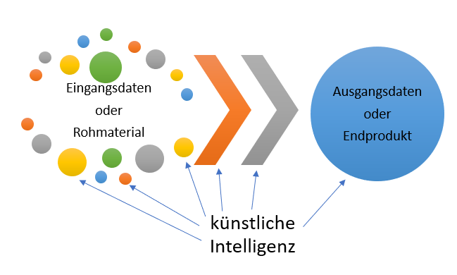
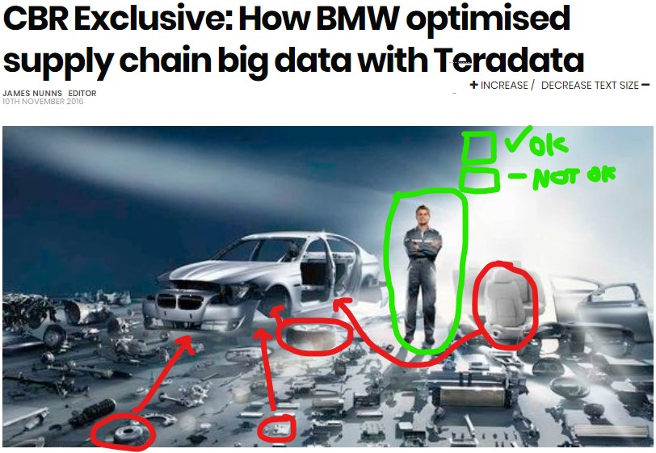
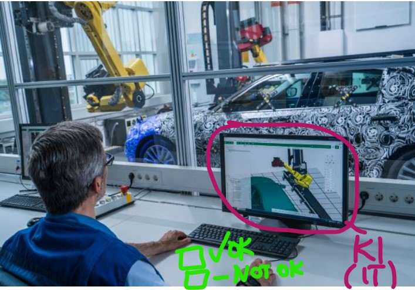
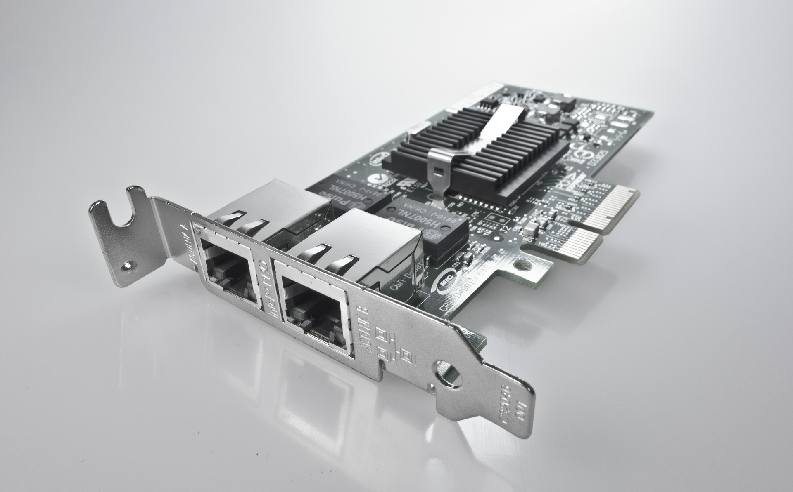
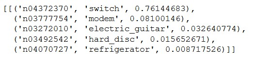
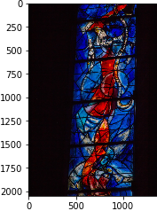

# Anwendungsfälle der KI in der Industrie

Autor: Andreas Traut  
Datum : 06.07.2020

[Download als PDF](https://raw.githubusercontent.com/AndreasTraut/Arbeitsproben/main/Anwendungsf%C3%A4lle%20der%20KI%20in%20der%20Industrie.pdf)

\[TOC\]

## Anwendungsfälle der künstlichen Intelligenz in der Industrie

Im vorliegenden Text möchte ich leicht verständlich erklären, was mit _"künstlicher Intelligenz in der Industrie" \(KI\)_ gemeint ist, Anwendungsbereiche beschreiben und mit praktischen Beispielen und Programmieranwendungen veranschaulichen, wie KI konkret umgesetzt werden kann.

Im _ersten Teil_ werde ich KI leicht verständlich erklären und einige Bereiche beschreiben, in denen KI bereits erfolgreich angewendet wird. Dabei gehe ich auch auf einige Besonderheiten ein, wie z. B. Big Data, Deep-Learning und Process Mining.

Im _zweiten Teil_ zeige ich an einem Beispiel wie der Automobilhersteller BMW von KI-Techniken profitiert hat.

Im _dritten Teil_ zeige ich, wie KI-Techniken beim Thema Bilderkennung in der Programmiersprache Python umgesetzt werden können und stelle dabei meinen Programmcode zur Verfügung.

Im _vierten Teil_ gebe ich einige Empfehlungen, auf was geachtet werden muss, wenn KI-Techniken in einem Unternehmen eingeführt werden sollen.

Ich denke, die Auswahl an weiteren Artikeln zur Vertiefung der Thematik _„Anwendungsfälle der künstliche Intelligenz in der Industrie“_ ist riesig und ich hoffe, dass diese kurze Einführung für den Einstieg hilfreich ist.

### 1. KI leicht verständlich erklärt

Mein Schaubild zeigt auf der linken Seite die **„Eingangsdaten“** \(oder Rohmaterial\) und auf der rechten Seite **„Ausgangsdaten“** \(oder Endprodukte\). Dazwischen laufen **Prozesse** ab \(dargestellt durch die beiden orange/grauen Pfeile\). Während der Laufzeit dieser Prozesse werden die Zwischenergebnisse üblicherweise mittels log-Dateien protokolliert und gespeichert \(was ebenfalls Daten sind\).

#### Was für "Prozesse" sind hier gemeint?

Beispielsweise könnten Maschinen Rohmaterialien verarbeiten, die während ihrer Verarbeitung einer gewissen Temperatur und einem gewissen Druck ausgesetzt sind. Temperatur und Druck werden durch Sensoren ermittelt, mit einem Zeitstempel historisiert und in log-Dateien gespeichert. Diese Prozesse können regional an verschiedenen Orten ablaufen oder organisatorisch in verschiedenen Unternehmenseinheiten. Darüber hinaus gibt es noch viele weitere Beispiele. Ich möchte einige weitere nennen, bei denen in der Praxis KI erfolgreich angewendet wird:

* **Absatzprognosen**: Die künstliche Intelligenz berechnet den zu erwartenden Absatz von Produkten auf Basis sehr vieler Eingangsdaten \(z. B. Börsendaten, Wetter, Rohstoffpreise, Zollbeschränkungen, Preisentwicklung an den Absatzmärkten, Inflation, Zinsen oder Social Media Trends\). Damit kann der erwartete Absatz besser bestimmt und die Produktion optimal gesteuert werden.
* **Automatische Bestellungen**: Die Bestellmengen und Bestellzeitpunkte für Rohmaterialien werden von der künstlichen Intelligenz automatisch ermittelt und optimiert. Damit soll verhindert werden, dass die Lagerkapazitäten überschritten werden oder dass Lieferengpässe entstehen. Außerdem sollen möglichst viele Rabattangebote der Zulieferer optimal genutzt werden.
* **Produktentwicklung für Serienproduktion**: Es werden automatisierte Tests an den Produkten durchgeführt und von der künstlichen Intelligenz validiert, so dass diese aufzeigen kann, wo an den Produkten noch Anpassungen vorgenommen werden müssen, damit sie kosteneffizient und ohne Fehler in Serie hergestellt werden können.
* **Qualitätskontrolle**: Es werden mittels Sensoren, Röntgenstrahlen oder hochauflösenden Kameras Bilder von den Produkten erzeugt. Die künstliche Intelligenz kann dann mit Bilderkennungsalgorithmen Fehler in den Produkten erkennen und diese aussortieren. 

In den Fußnoten habe ich weitere Artikel verlinkt. Die Liste könnte noch weitergeführt werden, aber diese Auswahl sollte die wichtigsten Bereiche umfassen.

#### Auf welche Daten hat die künstliche Intelligenz Zugriff?

Die künstliche Intelligenz hat nun Zugriff auf alle Daten:

* alle Eingangsdaten: beinhaltet auch alle Daten, die die Materialbeschaffenheit \(Länge, Breite, Gewicht...\) beschreiben
* alle log-Daten: beinhaltet auch alle Daten, die sich aus den Verarbeitungsschritten ergeben, wie z. B. Temperatur oder Druck mit denen Materialien verarbeitet werden
* alle Ausgangsdaten: beinhaltet auch Daten, die das Produkt bewerten. Beispielsweise könnte ein Mensch das Produkt als _"nicht ok"_ bewerten, weil es defekt ist oder weil eine wichtige KPI-Kennzahl nicht zufriedenstellend ist. 

Die künstliche Intelligenz weiß alles und kann somit jederzeit einen **Zusammenhang** zwischen „Eingangsdaten“ und „Ausgangsdaten“ \(bzw. „Rohmaterial“ und „Endprodukt“\) herstellen und hat dabei stets auch den Prozess \(die log-Dateien\) im Blick. Zum Beispiel: Sobald ein Mensch die „Ausgangsdaten“ oder das „Endprodukt“ als _„nicht ok“_ bewertet, kann die künstliche Intelligenz einen Rückschluss ziehen, welcher Eingangsparameter oder welcher Prozessschritt am relevantesten für die Anomalie war und kann einen Vorschlag machen, was geändert werden müsste.

#### Ist die künstliche Intelligenz wirklich intelligent oder nur ein sehr schlauer Algorithmus?

Die künstliche Intelligenz ist dabei gar nicht „intelligent“ wie wir Menschen es landläufig verstehen: KI ist nur ein Algorithmus, der diese Zusammenhänge mit Modellen darstellen kann. Hierbei gibt es unterschiedliche Ansätze, je nachdem, was gerade relevant ist:

* Wenn die Menge an Eingangsdaten riesig ist, spricht man von ["Big Data"](https://de.wikipedia.org/wiki/Big_Data). Das ist beispielsweise bei Sensordaten der Fall, also wenn kontinuierlich Temperatur, Druck oder Verfahrwege von Maschinen gesammelt werden. Jeder Datenpunkt für sich ist häufig nur eine einfache Zahl, aber in Summe entsteht mit der Zeit daraus eine riesige Datenmenge, die mit herkömmlichen Methoden der Datenverarbeitung nicht mehr bearbeitet werden kann. "Big Data" Ansätze unterscheiden sich teilweise recht stark von den herkömmlichen Ansätzen der Datenverarbeitung: Es kommen andere Systeme zum Einsatz, wie beispielsweise [Apache Spark](https://spark.apache.org/) \(um mit vernetzten Computern zu rechnen\) oder [Hadoop](https://hadoop.apache.org/) \(um sehr große Datensätze auf mehreren Rechnern verteilt zu bearbeiten\). Ich habe mich [hier](https://github.com/AndreasTraut/Machine-Learning-with-Python) damit beschäftigt, den Unterschied zu beschreiben, wenn man mit einem Big Data System arbeitet im Vergleich zu einer herkömmlichen Datenverarbeitung. 
* Treten hingegen die Eingangsdaten etwas in den Hintergrund \(also kein Big Data\), aber dafür die Prozesse in den Vordergrund, spricht man von ["Process Mining"](https://de.wikipedia.org/wiki/Process-Mining). Hier werden dann häufig die log-Dateien, die die Prozesse protokollieren, in Modelle transformiert und dann ausgewertet. 
* Von einem ["Deep Learning"](https://github.com/AndreasTraut/Deep-Learning)  Ansatz spricht man, wenn neuronale Netze zum Einsatz kommen. Das ist häufig der Fall, wenn die Eingangsdaten jeweils nicht nur einfache Datenpunkte sind, wie bei den Sensordaten, sondern eine komplexe Struktur haben, wie zum Beispiel Bilder oder Dokumente. Ein Bild besteht aus mehreren tausend Pixeln in jeweils beiden Bildachsen und für jeden dieser Pixel gibt es viele mögliche Farbschattierungen. Ein Dokument hat Sätze, Wörter und Buchstaben, die grammatikalischen und orthographischen Regeln folgen. Im "Deep Learning" Ansatz werden jeweils Gruppen von Pixeln bzw. Buchstaben mit sogenannten "Neuronen" verknüpft, die dann zusammen eine Schicht bilden. Eine Neuronenschicht gibt dann gemäß einer vorgegebenen Rechenoperation Daten an die nächste darüberliegende Neuronenschicht weiter und wenn hunderte solcher Schichten aufeinandergestapelt werden, erhält man ein neuronales Netz \(daher der Name "deep"\). Auch damit habe ich mich beschäftigt und [hier](https://github.com/AndreasTraut/Deep-Learning) meine Erfahrungen dokumentiert.

Mit KI Ansätzen können also die **Zusammenhänge** der Eingangsdaten, der log-Dateien und der Ausgangsdaten durchdrungen werden. Wie damit Profit generiert werden kann, erkläre ich im nächsten Abschnitt.

### 2. Wie hat BMW von KI profitiert?

Das „Capgemini Research Institut“ hat im Dezember 2019 [hier](https://www.capgemini.com/de-de/news/ki-in-der-industrie/) eine interessante Studie veröffentlicht: Darin wurden 300 Unternehmen aus den Sektoren industrielle Fertigung, Automobil, Konsumgüter, Luftfahrt und Verteidigung untersucht und es wurde dabei festgestellt, dass Unternehmen in Deutschland im Vergleich zu anderen Ländern bereits sehr viel künstliche Intelligenz in ihren Wertschöpfungsketten und Produktionsprozessen einsetzen, diese jedoch noch vertiefen sollten.

Ich möchte kurz ein konkretes Beispiel herausgreifen, auf das sich diese Studie unter anderem stützt \(siehe [https://www.cbronline.com/big-data/analytics/bmw-optimised-supply-chain-teradata-big-data/](https://www.cbronline.com/big-data/analytics/bmw-optimised-supply-chain-teradata-big-data/)\):

Quelle: BMW Group

Der Automobilhersteller BMW arbeitet an 31 Produktionsstandorten, an denen sehr komplexe Prozesse ablaufen. Im Bild oben habe ich versucht, die unzähligen verschiedenen Rohmaterialen rot darzustellen. Der Prozess von den Rohmaterialen bis zum Endprodukt \(dem Auto\) ist sehr lange, kompliziert und unübersichtlich und läuft teilweise über verschiedene Kontinente verstreut ab. Dabei wird an vielen Stellen im Prozessverlauf Inventar zwischengelagert. Eine große Herausforderung war es für BMW, die vielen Daten, die dabei entstehen in einer sinnvollen Form abzuspeichern \(Stichwort: [Data Warehouse](https://de.wikipedia.org/wiki/Data_Warehouse), [Data Lake](https://de.wikipedia.org/wiki/Data-Lake)\).

Einen Erfolg hat BMW im Jahr 2016 feiern können, als es bei der Analyse seines Inventars wertvolle Erkenntnisse gewinnen konnte: die Teams haben die Inventarkosten um 70% reduzieren können, weil sie mehr Transparenz über ihre vielen Produktionsorte gewonnen haben und die Prozesse optimieren konnten.

Im Jahr 2016 beschreibt Klaus Straub, CIO bei BMW in [diesem Artikel](https://www.i-cio.com/profession/cio-profiles/item/powering-digital-disruption-at-bmw>), die Ideen zur digitalen Transformation des Unternehmens. Schon damals sah er das große Potential, das durch Künstliche Intelligenz entstehen würde, um beispielsweise die **Qualität zu verbessern** oder die **Prozesse effizienter zu gestalten**, wobei die Verknüpfung der IT mit den realen Produktionsabläufen eine große Herausforderung sein würde.

Doch wie lässt sich das konkret umsetzen? Darüber möchte ich im folgenden Abschnitt einen Einblick geben.

### 3. Wie können KI-Techniken konkret umgesetzt werden?

Es gibt viele kostenlose und frei verfügbare \([Open-Source](https://de.wikipedia.org/wiki/Open_Source)\) Tools, die man je nach Fragestellung nur noch auf die eigenen Bedürfnisse anpassen muss. Wie genau das geht, zeige ich im Folgenden jeweils in meinem Programmcode.

#### Was ist auf dem Bild zu sehen?

Wenn beispielsweise ein Bild von einem Bauteil vorliegt und sich die Frage stellt, was auf diesem Bild abgebildet ist, könnte ein Mensch das durch bloßes draufschauen schnell herausfinden. Der Mensch könnte auch sehen, ob das Bauteil defekt ist oder nicht. Die KI kann das auch und für diese Fragestellung wähle ich einen Deep-Learning Ansatz und nutze dabei das auf dem Bild-Datensatz ["ImageNet"](http://www.image-net.org/) bereits trainierte ["ResNet50"](https://www.tensorflow.org/api_docs/python/tf/keras/applications/ResNet50) Netz. Ich spare mir dadurch sehr viel Programmieraufwand und somit sind für mich nur 10 Zeilen Programmcode notwendig, damit mir das Modell sagt, dass es auf dem linken Bild mit 86% Wahrscheinlichkeit eine "Tasse" sieht und mit 6.8% eine "Kaffeetasse \(coffepot\)". Im rechten Bildsieht das Modell mit 76%-iger Wahrscheinlichkeit ein "Switch-Bauteil". Meinen Programmcode können Sie [hier](https://github.com/AndreasTraut/Deep-Learning/blob/master/Image_classification/Image_classifier_example_2_transfer_learning_ResNet52-German.ipynb) einsehen.

|  |  |
| :--- | :--- |
|  |  |

#### Welche Gruppen können gebildet werden?

Angenommen wir haben ein Bild, über das wir noch nicht viel wissen und welches wir in eine uns bekannte Gruppierung einordnen möchten. Beispielweise ein Röntgenbild, bei dem wir uns fragen, ob und welche Krankheit darauf zu sehen ist. Oder ein Bild einer Pflanze für das wir den Namen und Pflegehinweise wissen wollen. Auch Texte können gruppiert werden. Bei einem Dokument oder Vertrag können wir auf der Suche nach ähnlichen Texten sein. Das Gruppieren von ähnlichen Dingen ist ein häufig diskutiertes Problem. Wir kennen alle die nützliche Google-Funktion, mit der sich ähnliche Bilder anzeigen lassen. Man gibt einen Begriff \(z. B. Espressotasse\) in die Suchleiste ein und bekommt ähnliche Bilder angezeigt:

Bei der Umsetzung des Programmcodes stellen sich zwei Fragen. Die erste Frage ist:

Wie vergleicht man zwei Bilder miteinander? Oder zwei Texte? Das ist nicht einfach, aber dieses Problem ist schon vielfach analysiert worden. So gibt es Vorgehensweisen, die man nur kopieren muss, und ich werde Ihnen gleich zeigen wie.

Die zweite Frage ist: Wie geht man vor, um alle Dinge \(Bilder oder Texte\) paarweise miteinander zu vergleichen? Nehmen wir 1 Million Dinge, die wir paarweise miteinander vergleichen, um damit die Gruppen bilden zu können. Dann haben wir schon 1 Million mal 999 999 / 2, also etwa 500 Milliarden Rechenoperationen. Das kann sehr lange dauern. Da es sich bei dieser Fragestellung um sehr viele Eingangsdaten handelt, wähle ich einen Big Data Ansatz, nämlich das "Local-Sensitive-Hashing" \(LSH\). LSH ist eine Technik, um ähnliche Dinge mit einer hohen Wahrscheinlichkeit in Gruppen einzuteilen. Man verzichtet also auf absolut exakte Ergebnisse und nimmt eine kleine Fehlerwahrscheinlichkeit in Kauf. Diese Wahrscheinlichkeit kann mit Steuerungsparametern eingestellt werden \(je nach Bedarf\). Sind diese Parameter einmal eingestellt, kann der KI-Algorithmus sehr schnell neue Bilder in Gruppen einordnen. Der Vorteil auf eine absolut exakte 100%-ige Gruppierung zu verzichten, liegt auf der Hand: LSH läuft viel schneller als 100% exakte Algorithmen.

Das Ergebnis meiner Arbeit war: Ich habe auf über 9000 Bildern \(je etwa 300\*300 Pixel\) den LSH Algorithmus angewendet, unter anderem auch meine Sammlung an Kirchenfenstern und Espressotassen \(ich trinke gerne Espresso und habe irgendwann angefangen, die Tassen zu fotografieren\). Auf meinem eigenen Computer hat diese Gruppierung ein paar Minuten gedauert und war nur einmalig notwendig. Danach habe ich ein völlig neues Bild einer Espressotasse aus dem Internet heruntergeladen:

Dieses Bild habe ich dem Programm gegeben und damit dann ähnliche Bilder aus meiner Bildersammlung suchen lassen. Nach wenigen Sekunden hat mir das Programm dann diese 15 Bilder angezeigt:

Dasselbe habe ich dann auch für meine Kirchenfenster Bilder getestet mit diesem Testbild:

Ergebnis:

Wer einen kurzen Blick auf die Programmzeilen werfen möchte, um sich zu vergewissern, dass nur wenige Codezeilen für dieses Problem nötig sind, kann [hier](https://github.com/AndreasTraut/Deep_learning_explorations/blob/master/8_Image_similarity_search/Beispiel_aehnliche_Bilder_finden.ipynb) meinen Programmcode einsehen und [hier](https://github.com/AndreasTraut/Deep_learning_explorations/blob/master/README.md) noch meine weitere Erklärungen lesen. Außerdem habe ich [hier](https://github.com/AndreasTraut/Deep-Learning) die Deep-Learning Thematik vertieft erklärt.

Im nächsten Abschnitt gebe ich Ihnen ein erstes Konzept an die Hand, um KI Techniken in Ihrem Unternehmen einzuführen.

### 4. Welche Empfehlungen zur Umsetzung von KI Techniken würde ich Ihnen geben?

Falls Sie nun Interesse haben, auch in Ihrem Unternehmen künstliche Intelligenz einzusetzen, ist die Empfehlung, dass Sie sich folgende Gedanken machen:

Was erwarten Sie, dass Ihnen die Analyse Ihrer Daten konkret für Vorteile bringen sollte? Sammeln und strukturieren Sie zunächst Hintergrundwissen über Ihr Unternehmen: Welche Unternehmenseinheiten sind betroffen, wer sind die Schlüsselpersonen, wer ist „Sponsor“ des Projekts?

* Beschreiben Sie das Problem und die Motivation für das Datenanalyse-Projekt. Machen Sie sich auch Gedanken über die derzeitige Situation, deren Vor- und Nachteile. Dies benötigen Sie zum Abgleich mit dem neuen Datenanalyse-Projekt. 
* Beschreiben Sie, wie ein erfolgreich umgesetztes Datenanalyse-Projekt aussehen würde: Gibt es Erfolgskennzahlen \(objektive Ziele\) oder subjektive Ziele, die Sie definieren bzw. beschreiben können, um den „Erfolg“ des Datenanalyse-Projekts für Ihr Unternehmen zu messen? Es ist wichtig messbare Unternehmensziele zu definieren, damit sich daraus weitere messbare Ziele zur weiteren Umsetzung des Datenanalyse-Projekts ableiten lassen: Welche Art von Datenanalyse soll für das Problem angestrebt werden? Welche Daten werden für diese Modelle konkret benötigt und welche technischen und organisatorischen Schritte sind nötig, um diese Daten aus verschiedenen Quellen zu extrahieren, zu transformieren, modellieren und evaluieren? 
* Stellen Sie sich früh auch die Fragen, wie das "Deployment" ablaufen soll, also wie die Programme, die in einer Testumgebung entwickelt wurden, im täglichen produktiven Betrieb zum Laufen gebracht werden sollen. Sollen eigene Computer verwendet werden oder die Cloud? Gelten in Ihrem Unternehmen hohe Datenschutz-Anforderungen ist eine Cloud-Lösung vielleicht nicht die erste Wahl und zu hinterfragen. Eine teure Investition in eigene Hardware könnte dann der nächste Schritt für Sie sein. Möchten Sie hingegen erst einmal verschiedene Dinge ausprobieren und sind Sie noch nicht bereit, massiv Kapital in neue Hardware zu investieren, dann könnte eine Cloud-Lösung ideal für Sie sein. Meine Erfahrungen, die ich mit der Microsoft Azure Cloud Plattform gesammelt habe, können Sie [hier](https://github.com/AndreasTraut/Experiences-with-MicrosoftAzure) nachlesen. 

Es gibt methodische Ansätze, die sich bei der Transformation in ein solches Datenanalyse-Projekt anwenden lassen. Da die Kosten für Big Data Systeme enorm hoch sind \(finanzielle Kosten aber auch die Zeit, die Ihre Mitarbeiter gebunden sind\) und in der Regel viele Unternehmensbereiche betroffen sind, empfiehlt es sich, einen strukturierten Ansatz zu gehen.

Ich hoffe, dass meine kurze Einführung in die Thematik _„künstliche Intelligenz in der Industrie“_ für den Einstieg hilfreich war und denke, dass die Auswahl an weiteren Artikeln zur Vertiefung der Thematik riesig ist. Viel Spaß und Erfolg bei der weiteren Recherche und Umsetzung wünscht Ihnen

_Andreas Traut_

## MIT License

Copyright \(c\) 2020 Andras Traut

Permission is hereby granted, free of charge, to any person obtaining a copy of this software and associated documentation files \(the "Software"\), to deal in the Software without restriction, including without limitation the rights to use, copy, modify, merge, publish, distribute, sublicense, and/or sell copies of the Software, and to permit persons to whom the Software is furnished to do so, subject to the following conditions:

The above copyright notice and this permission notice shall be included in all copies or substantial portions of the Software.

THE SOFTWARE IS PROVIDED "AS IS", WITHOUT WARRANTY OF ANY KIND, EXPRESS OR IMPLIED, INCLUDING BUT NOT LIMITED TO THE WARRANTIES OF MERCHANTABILITY, FITNESS FOR A PARTICULAR PURPOSE AND NONINFRINGEMENT. IN NO EVENT SHALL THE AUTHORS OR COPYRIGHT HOLDERS BE LIABLE FOR ANY CLAIM, DAMAGES OR OTHER LIABILITY, WHETHER IN AN ACTION OF CONTRACT, TORT OR OTHERWISE, ARISING FROM, OUT OF OR IN CONNECTION WITH THE SOFTWARE OR THE USE OR OTHER DEALINGS IN THE SOFTWARE.

## Fußnoten

