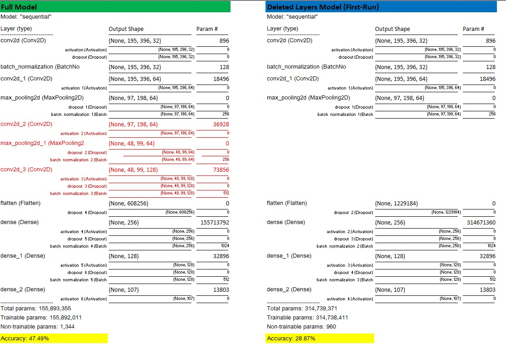

Autor:  Andreas Traut  
Datum: 14.08.2020  
[Download als PDF](https://github.com/AndreasTraut/Deep-Learning/raw/master/README.pdf)  

# Deep-Learning examples with TensorFlow

[TOC]

## I. Installation, technical environment and deployment

Before I start with examples I want to spend a few words about the **technical environment**, which I used for the development of the models: 

We know from the [CRISP-cycle](https://en.wikipedia.org/wiki/Cross-industry_standard_process_for_data_mining) that the *"deployment"* (that means: *"how to bring a model into a productive environment"*) is a critical step. The productive environment often requires a robust, scalable setup with real-time availibilty, but all this is restricting the ease-of use and flexibility for developing models. Therefore a model can be built in a different system or language as where it is run in production which leads to the question: how can a model (and required data) be transfered from the developing environment to a productive environment? Depending on how you decide to develop your models, the following will happen: 

- when you <u>deploy</u> you will have extra time-consuming effort to re-coding everything in the productive environment

- when you <u>develop</u> you will have extra time-consuming effort to build the model in the development environment. 

You can also see in III.1. (where I used the Fast.AI library) how important this can be: I made some negative experiences of constantly changing requirements to call functions from the Fast.AI libraries. Because of these negative experiences, I decided to switch to [TensorFlow](https://www.tensorflow.org) (which is an open-source machine learning platform and probably the most important one at the moment). There are several options to run a tensorflow calculation. In order to learn about the advantages and disadvantages of these options and in order to give you a better basis for deciding, which technical requirement is best for your needs, I tested all of them: 

- **Colab (Cloud)**: I used [Google-Colaboratory](https://colab.research.google.com/notebooks/intro.ipynb), a machine learning education and research project from Google, which runs entirely in the cloud, and uploaded my Jupyter-Notebooks there. 
- **"Locally" on my own computer**: I am using [Anaconda](https://www.anaconda.com/), an open-source data scientist platform, and installed tensorflow 2 in a separate tensorflow environment, which I created for this purpose, on my own computer. 
- **Docker container**: I downloaded a "container", which had tensorflow 2 pre-installed, from [Docker](https://www.docker.com), a platform, which delivers software in isolated packages. Then I implemented my notebooks there and uploaded my results to [my docker account](https://hub.docker.com/u/andreastraut).

Here is what I found: 

#### 1. Colab (Cloud)

Colab (Cloud) is the easiest one to use for the development of new models. Everything is running in the google cloud, so you should not be afraid of the privacy of your data, if you want to use this option. Everything you need is already pre-installed in Colab, so you won't have installation issues (if you need some special additional packages later, you can install them easily later). Run-time is also very good, as you are using rather fast cloud computers. But I think bringing everything to a privacy secure environment in production can be an interesting question. 

#### 2. "Locally" on my own computer 

"Locally" on my own computer means, that you can see everything, which is going on, but you can run into difficulties with dependencies of different required sub-packages. So installation can be challanging for you, if you don't know what "pip", "conda" or "environment" means. Also depending on your own local computer the run-time won't be as good as the Colab solution. I tested a similar solution in Colab versus my local computer and Colab was about twice as fast (I have a Intel Core i7-8700 CPU @ 3.2 GHz **CPU** with 16 GB RAM and a Nvidia GeForce **GPU**). But calculating locally also means, that you can start the calculation and go away from your computer (even overnight) and examine the results later. A big advantage. I started a calculation on Colab overnight and got the next day a message "Calculation finished. Connection to cloud computer lost due to inactivity": my results were unfortunately lost. Running everything locally on your computer is also good solution if you want to have a lot of privacy (most European companies prefer having their data protected). 

#### 3. Docker container 

Docker container seems to be always a good approach, when you want to avoid installation issues. It is a bit easier to install than the "local" version, because learning what a "container " is, seems not to be too challenging compared to learning how to install everything locally on your computer. At least to me. I also used docker, when I wanted to learn more about [Apache Spark](https://spark.apache.org/) and [Hadoop](https://hadoop.apache.org/). See my dockerfile [here](https://hub.docker.com/repository/docker/andreastraut/machine-learning-pyspark) and my documentation [there](https://github.com/AndreasTraut/Machine-Learning-with-Python). Run-time when using docker is pretty much the same as "locally" if you run the docker container on your own computer. But as you can easily push a docker container to the cloud (e.g. to Amazon EWS), the run-time will be a lot quicker (depending on your cloud computer). And obviously you have many options for choosing the cloud computer, which meets your requirements (e.g. speed and privacy requirments): there is [Google Cloud](https://cloud.google.com/?hl=de), but also [Microsoft Azure](https://azure.microsoft.com/de-de/) or [Amazon EWS](https://aws.amazon.com/de/). See for example my experiences, which I made with Microsoft Azure [here](https://github.com/AndreasTraut/Experiences-with-MicrosoftAzure). As most companies have Microsoft anyway in their IT infrastructure (e.g. Outlook, Word, Excel), the choice for a Microsoft Azure cloud computer seems to be rather justifiable to me. 

## II. Example: "Image classification on Cifar10"

As a first example I will work on image classification as follows: 

#### 1. Choose a dataset

I choose the dataset *"Cifar10"*, which is a very well known and studied dataset of 60'000 small photos with 10 classes (e.g frogs, trucks, cars, horses,...):   

For comparing the results I used the *"Cifar100"*, which has 100 classes instead of 10. 

#### 2. Define a model

There are many possibilities to define a model. The most known **Convolutional Neural Network (ConvNet or CNN)** models are [LaNet](https://en.wikipedia.org/wiki/LeNet) (one of the earliest ConvNets as of 1988), [AlexNet](https://en.wikipedia.org/wiki/AlexNet) (uses GPU with impressive low error in the 2012 ImageNet competition), [ResNet](https://en.wikipedia.org/wiki/Residual_neural_network) (uses skip connections, see a example [here](Image_classification/Image_classifier_example_2_transfer_learning_ResNet52.ipynb)), [VGGNet](https://neurohive.io/en/popular-networks/vgg16/) (uses very small convolution filters), [ZFNet](https://pechyonkin.me/architectures/zfnet/) (introduced "deconvolution" and a better ConvNet visualization and won the ImageNet competition in 2013),... 

As my dataset (*Cifar10*) has been studied for a very long time already, I do not need to reinvent the wheel again: I have the choice to take any of these great ConvNet-models and amend it for my needs. E.g. do I want high acurary/long calculation time? Or do I want reasonable calculation time/lower accuracy? I choose a sequential model, which is not too complicated, as follows: 

| Description of my Model **`(find a explanation for the bold terms below the table)`** | Shortform         |
| ------------------------------------------------------------ | ----------------- |
| First layer is a **`convolutional layer`** with 32 filters (=the dimension of of the output space), same padding and a **`ReLu activation function`**, then 20% **`dropout`** and a **`batch-normalization`**. | Conv32            |
| Second layer is another convolutional layer with 64 filters, same padding and ReLu activation funct | Conv64            |
| Third layer is a **`2x2-max-pooling layer`**, then 20% dropout and a batch-normalization. | MaxPool2x2        |
| Then repeated the steps "second layer" and "third layer" again. | Conv64 MaxPool2x2 |
| Then another convolutional layer, but with 128 filters and a ReLu activation function, 20% dropout and batch-normalization. | Conv128           |
| Then flattened the data and another 20% dropout.             | Flatten           |
| Next a **`densely connected layer`** with 256 units and a MaxNorm=3 kernel-constraint (for the weights) using a ReLu activation function, then 20% dropout and a batch-normalization. | Dense256          |
| Then another densely connected layer, but with with 128 units. | Dense128          |
| Finaly a softmax activation function to choose the neuron with the highest probabilty as the class to which the image belongs to. Choosing a Softmax here is the only choice, because I used a categorial_crossentopy loss function when compiling the model. | Softmax           |

There are tons of documentations concerning image classification models like mine above, so I only spend a few words here to explain the most important terms and you will definitively need to read further documentation: 

- **`convolutional layers`** reduce the images to a form which is easier to progress. If this operation is done with the same dimensionality we call this "same padding" (otherwise "valid padding").

- **`ReLu`** is the "hockey-stick" function (a bit similar to the "Call-Option", which we know from finance) and possibly the mostly used activation function in hidden layers as it avoids vanishing gradients (alternative activation functions like the Sigmoid or Tanh do have this problem). 

- **`2x2-max-pooling layer`** is downsampling the dimensionality of the input by keeping only the maximum in a moving 2x2 window (therefore a reduction 4 -> 1). 

- **`dense layer`**: Traditionally neural networks connect the output of the n-th layer to the next (n+1)-th layer. As this causes vanishing gradients several improvements have been made. First: ResNet improves this by allowing a "skip connection" from a deeper layer directly to a much higher layer (and skipping a layer inbetween these). Next: Dense layers further improve this by "concatenating" (and not only summing like ResNet does) these skip connections. 

- **`dropout`** is a regularization technique (like the L1 and L2 regularization), which randomly selects nodes and removes them (avoids overfitting). 

- **`batch-normalization`** applies a transformation that maintains the mean to 0 and standard deviation close to 1.

  

#### 3. Compile and train the model

For compiling the model one has to choose a lossfunction in order that the model can seek a minimum during the training. Here, I choose the "categorial_crossentropy" lossfunction, which required me to use the Softmax activation function at the end. I used an adam optimizer with default learning rate of 0.001 and calculated 25 epochs on a batchsize of 64. 

#### 4. Evaluate the accuracy of the model

The accuracy of this model applied on the *"Cifar10"* dataset was 82%, which is not impressive, but ok for this initial approach. See below the learning curve. On the *"Cifar100"* the same model received only 53% acuracy (see [here](Image_classification/Image_classifier_example_calculate_and_save_cifar100.ipynb)). This is rather low and here the fun part begins: what can I amend to improve the accuracy? Adding more layers? Yes, one possibility (apart of others like image augmentation, choosing better hyperparameters,...) knowing that the calculation time will also increase when you add more layers. Let's talk a bit about the size of the model: 

Currently I have over 2 million parameters in the model above. As I have 50'000 training images for *Cifar10* and as I choose the size of each batch to have 64 pictures there will be 782 batches to be calculated for each epoch. Taking 25 epochs will lead to 19'500 batches to be calculated in total. The logfile told me, that one epoch took me a few minutes (about 2-5 minutes), which is about 2-3 hours for the whole calculation. 

Tensorflow is providing a very nice tool, called **TensorBoard**, which allows to examine the log-files and intermediate steps for each epoch or even eatch batch in detail. Another big advantage of using Tensorflow.

#### 5. Implement the model in different technical environments

As promised I provided these implementations in the three described environments (locally, Colab Cloud, Docker container):  

| Purpose                                                      | locally                                                      | Colab                                                        | Docker                                                       |
| ------------------------------------------------------------ | ------------------------------------------------------------ | ------------------------------------------------------------ | ------------------------------------------------------------ |
| <u>For calculating and saving the model:</u> Use these notebooks for importing the data, compiling and evaluating the model and saving the results afterwards. | see [here](Image_classification/Image_classifier_example_calculate_and_save.ipynb) | see [here](https://colab.research.google.com/drive/1eF2OY4CYnwzHTi6RT__lEG_LN-cijl3i?usp=sharing) | see [here](https://hub.docker.com/repository/docker/andreastraut/deep-learning) |
| <u>For loading a saved model:</u> As we don't want to re-run the whole calculations above, here is how to load a saved model. | see [here](Image_classification/Image_classifier_example_load.ipynb) | see [here](https://colab.research.google.com/drive/1Dvn-AE6XWtgapd_HMqx4oXDRvBZdjgDv?usp=sharing) | see [here](https://hub.docker.com/repository/docker/andreastraut/deep-learning) |

   

## III. Example: "Image classification on Caltechown"

In my second example I want to re-use my "Caltechown" dataset, but now in Tensorflow instead of fastAI. So let's start by motivating, why I want to do this again: 

#### 1. Motivation

Possibly you already read about my espresso cup experiment, where I added my own photo series of espresso cups (and also church windows and clocks) to the *"Caltech101"* dataset and applied a  ***"Local-Sensitive-Hashing Algorithm"***, in order to learn about this interesting Big Data technique. If not you can have a look [here](https://github.com/AndreasTraut/Deep_learning_explorations). 

Summarized in a few words: 
I used the "ResNet34" model (a very well known and studied model) and applied the **fastAI library**, which is a library based on PyTorch. PyTorch has initially been developed by Facebook and is one of the most interesting alternatives to Tensorflow (which has initially been developed by Google). But I didn't like these constantly changing requirements and frustrating installation issues, which I had with the fastAI library due to dependencies of sub-libraries (see my comments [here](https://github.com/AndreasTraut/Deep_learning_explorations/blob/master/8_Image_similarity_search/Image%20similarity%20on%20Caltech101%20using%20FastAI%2C%20Pytorch%20and%20Locality%20Sensitive%20Hashing_amendedTraut.ipynb)). I was surprised, when I learnt that newer fastAI versions are incompatible to previous versions. The provided training material from last year did not work with the current fastAI version. Interesting approach. To me fastAI seems to be a nice playground for students, but nothing I would take into consideration for a productive environment in a company. Remenber my initial words on the "technical environment": this can be a very time-consuming! I decided not to continue with fastAI. 

Switching to **Tensorflow** was a big relief to me: not only because of the nice Colab Cloud solution, where everything is already pre-installed and running on powerful computers in the cloud, or because of Tensorboard (a very nice tool measuring and visualizating machine learning workflows). It's also because of the incredibly extensive and useful documentation!

#### 2. Compare "Full model" and "Deleted Layers Model"

As the images in *Cifar10* were a lot smaller (32x32 pixel) I already expected, that the same full model as above would take a lot of time to calculate. I couldn't wait and therefore I deleted some layers (the red ones) and received a very bad 29% accuracy (see "Deleted Layers Model"). The full model had all these layers included but took several hours on my local computer. I saw an improvement to 47% accuracy, but this needs some further improvements in order to be satisfyting.

Are these predictions always false because of the low accuracy? The answer is: no, the predictions are not always false but not very reliable. We will see shortly why. 

#### 3. Would more epochs or a higher learning rate lead to better results? 

The final accuracy on the full model after having calculated 5 epochs was only 47.5%. The question might be: should I have calculated more epochs? Why stopping so early? Yes, I could have calculated more epochs, which would take me even more time (I already spent several hours on these 5 epochs). But as I saw in the picture below, that the accuracy increased only very, very slowly and had some sort of "plateau" at epoch 4 already, I doubt that calculating more epochs would have led to better results. 

I could have made better assumptions concerning the learning rate (I used the default value of 0.001) or I could have used a more advanced approach for defining the learning rate, e.g. use learning rate decay. But I also doubt, that this would changed anything here knowing that a learning rate, which is too high would lead to undesirable divergent behaviour. See in the picture below, where I took a 10 times higher learning rate of 0.01 (the jump in validation-loss is supicious): 

Decreasing the learning rate would even worsen the calculation time, because the steps are even smaller then. I think the best to improve the results is to think about "transfer learning", which will be my next step.  

#### 4. What is "transfer learning"?

The question might be: why is this accuracy for the *"Caltechown"* examplesee [here](Image_classification/Image_classifier_example_2_loadJPG_calculate_save_caltechown.ipynb) (implemented in Tensorflow) so much lower compared to the *"Caltech-101"* example, which I implemented in fastAI (see [here](https://github.com/AndreasTraut/Deep_learning_explorations))? The reason is **"transfer learning"**, which I will explain now: 

There are differents layers in a model and they serve differents aims. The initial layers are mostly for understanding low-level features and these layers should find e.g. curves, shapes, lines, patterns or shapes. The next layers capture high-level features, like the shape of an espresso cup. 

When you load a model from fastAI it will by default have all layers frozen with pre-trained weights. In other libraries you would need to freeze them, e.g. by using the command `learn.freeze()`. Freezing prevents, that well trained models, like the *"ResNet34"*, from being modified: gradients are not calculated for these layers. 

In the fastAI library the command `learn.fit_one_cycle(2)` trains only the last layer and all other layers are kept frozen. Afterwards in order to make all layers trainable the command `learn.unfreeze()` is used and all weights can get updated from the pre-trained state according to the chosen loss function. So we don't start from scatch on these layers: we start from a pre-trained point. 

This technique is called **"transfer learning"**: we want *"to use the knowledge gained from other models and use it for solving different but related problems"* (see [here](https://en.wikipedia.org/wiki/Transfer_learning)). In the *"Caltech-101"* example (see [here](https://github.com/AndreasTraut/Deep_learning_explorations)) I applied transfer learning by using the *"ResNet34"* model and pre-trained weights, but I didn't use this technique in the *"Caltechown"* example above. I can easily do this, as Tensorflow offers a lot of pretrained models, which can be used with very few lines of code, as you can see in my example [here](Image_classification/Image_classifier_example_2_transfer_learning_ResNet52.ipynb): I loaded the *"ResNet50"* model by using the pre-trained weigths from the ImageNet dataset (see `weights='imagenet'`) and applied it on my espresso cup picture (which is definitively not part of this dataset, because it's my own picture). 

The result is, that the model is 86% sure, that this is a "cup" and further 11.9% (6.7% plus 5.2%)  go to "coffeepot or "coffee_mug", which is in total about 98% for something related to "cup" or "coffee": 

This is an impressive result specially because with four lines of code everyone can solve this classification problem even without understanding the whole concept of deep-learning. 

#### 5. How does a prediction work? 

The answer is: given an image like the following two (the plane and the espresso cup) the model will calcualte for each class a score. The class, which has the highest score is the prediction. In this example the plane is from class 1 and the model correctly predicted the class 1 (as this has the highest score). The espresso cup is form class 102 (*Caltech101* has 101 classes and the espresso cup is the first I added additionally to these 101 classes, so 102). The model correctly predicted 102. 

When examining the scores of the other classes we can get an idea "how sure" the model was. In the full model above the model was pretty sure because the length of the other scores are significantly smaller. But in the model where I deleted some layers (see below) the model wasn't any more very sure despite the fact that the predictions for these two images are still correct: 

Here are some more predictions, were both models found the class correctly: 

I made further tests to also find these "unreliable" predictions, which I talked about above. Here they are (and there are a lot more, which is the reason, why the accuracy of 47% is not very satisfying): 

- both models are false

- full model is correct, but "Deleted Layers Model" not: 

  

## IV. More examples

The examples above explained how image recognition is done by using a neural networks in tensorflow. I hope you understood the basic concepts (e.g. what is a layer,...). But instead of programming a network yourself, you can also use deep-learning technology from companies like Microsoft or Amazon. See for example [Microsoft Maschninelles Sehen](https://azure.microsoft.com/de-de/services/cognitive-services/computer-vision/) or [Amazon Rekognition](https://aws.amazon.com/de/rekognition). These frameworks are easier to use, because there are no programming skills needed. The scope of these applications is also a lot wider: apart of image recognition (still images) they offer analysis of videos (moving images). These frameworks can label different objects in these images, recognize text in these images and do this as a process flow on scalable cloud engines on massive amounts of pictures. 

## V. Example: "Text classification"

As a next example I would like to switch to text classification. 

#### 1. Recurrent neural networks (RNN) versus Convolutional neural networks (ConvNet)

to be continued ... 

---

# MIT License

Copyright (c) 2020 Andras Traut

Permission is hereby granted, free of charge, to any person obtaining a copy
of this software and associated documentation files (the "Software"), to deal
in the Software without restriction, including without limitation the rights
to use, copy, modify, merge, publish, distribute, sublicense, and/or sell
copies of the Software, and to permit persons to whom the Software is
furnished to do so, subject to the following conditions:

The above copyright notice and this permission notice shall be included in all
copies or substantial portions of the Software.

THE SOFTWARE IS PROVIDED "AS IS", WITHOUT WARRANTY OF ANY KIND, EXPRESS OR
IMPLIED, INCLUDING BUT NOT LIMITED TO THE WARRANTIES OF MERCHANTABILITY,
FITNESS FOR A PARTICULAR PURPOSE AND NONINFRINGEMENT. IN NO EVENT SHALL THE
AUTHORS OR COPYRIGHT HOLDERS BE LIABLE FOR ANY CLAIM, DAMAGES OR OTHER
LIABILITY, WHETHER IN AN ACTION OF CONTRACT, TORT OR OTHERWISE, ARISING FROM,
OUT OF OR IN CONNECTION WITH THE SOFTWARE OR THE USE OR OTHER DEALINGS IN THE
SOFTWARE.